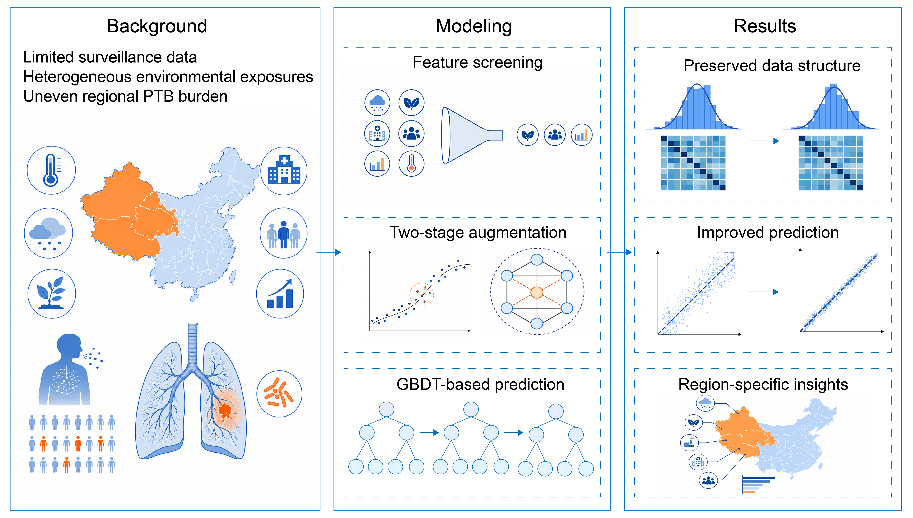

# Structure-preserving data augmentation for region-sensitive infectious disease prediction under data scarcity
This repository contains the code supporting the manuscript:

**Structure-preserving data augmentation for region-sensitive infectious disease prediction under data scarcity**
## Overview

This study develops a region-sensitive, structure-preserving data augmentation framework for infectious disease risk prediction under data scarcity. The empirical case study uses monthly pulmonary tuberculosis incidence in China together with environmental, ecological, socioeconomic, demographic, and healthcare-resource indicators.

